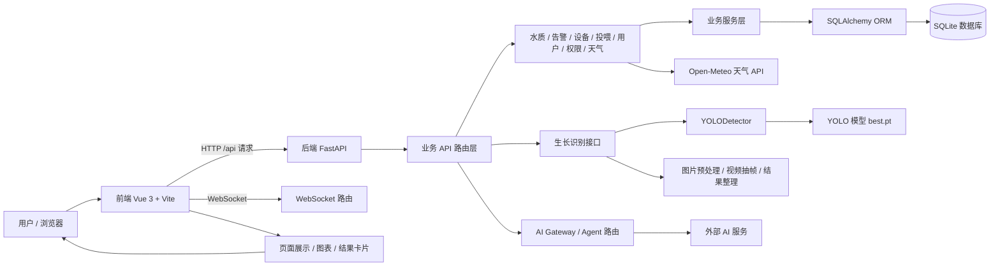
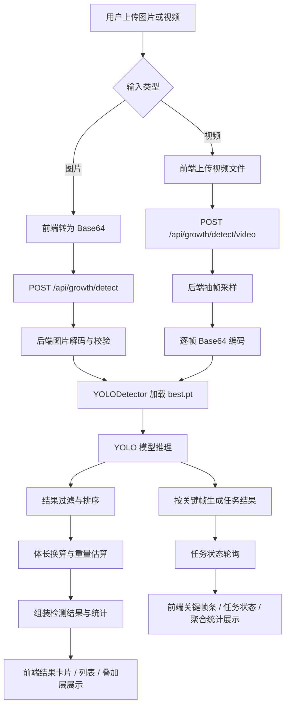

# 智渔精养·石斑鱼智慧养殖一体化系统

## 1. 项目简介
智渔精养·石斑鱼智慧养殖一体化系统是一个前后端分离的渔业管理应用，后端基于 FastAPI 提供统一 API 与 WebSocket 能力，前端基于 Vue 3 + Vite 构建交互界面。仓库内已包含水质监测、智能投喂、设备/告警管理、用户与权限管理、天气查询，以及“生长识别”相关的图片和视频识别能力。

系统主要用于渔业日常管理与识别分析：既可记录和查看水质数据、设备状态与告警，也可通过唯一的 YOLO 模型对鱼类生长状态进行图片识别和视频关键帧识别，并在前端页面中展示识别结果、统计信息和视频任务状态。适用场景包括鱼塘监控、养殖生产管理、生长辅助识别、投喂建议查看与管理后台操作。

## 2. 技术栈

| 分层/类别 | 具体技术或依赖 | 用途说明 |
|---|---|---|
| 前端框架 | Vue 3 | 构建单页应用界面 |
| 前端构建工具 | Vite | 本地开发、打包构建、代理转发 |
| 前端语言 | TypeScript | 前端类型约束与模块开发 |
| UI 组件库 | Element Plus | 表单、表格、弹窗、标签等界面组件 |
| 状态管理 | Pinia、pinia-plugin-persistedstate | 管理用户、系统配置、AI 等状态 |
| 路由 | vue-router | 页面路由与权限路由控制 |
| HTTP 请求 | axios | 调用后端 API |
| 图表 | echarts、vue-echarts | 展示统计图表与趋势图 |
| 视频播放 | xgplayer、hls.js | 播放视频或流媒体资源 |
| 富文本/内容处理 | @wangeditor/editor、marked、dompurify | 内容编辑、Markdown 渲染与安全处理 |
| 文件处理 | xlsx、file-saver | 导入导出与文件下载 |
| 可视化/工具 | @vueuse/core、mitt、nprogress、qrcode.vue | 常用交互、事件通信、进度条与二维码 |
| 样式工程化 | Tailwind CSS、Sass、Stylelint、Prettier | 样式开发与代码规范 |
| 后端框架 | FastAPI | 提供 REST API 与 WebSocket 路由 |
| 后端运行 | Uvicorn | 启动 FastAPI 服务 |
| 后端语言 | Python 3.11+ | 后端业务实现 |
| 数据库 | SQLite、SQLAlchemy、sqlalchemy-utils | 持久化水质、用户、告警等数据 |
| 数据校验 | Pydantic、pydantic-settings | 配置与接口数据模型 |
| 鉴权/密码 | passlib[bcrypt] | 密码处理与认证相关能力 |
| AI / 模型 | torch、torchvision、ultralytics、Pillow、opencv-python | 图片/视频识别与 YOLO 推理 |
| 外部接口 | httpx、Open-Meteo API | 获取天气数据 |
| 环境配置 | python-dotenv | 读取后端 `.env` |
| 工程化工具 | uv、pnpm | 后端与前端依赖管理 |

## 3. 系统架构图



## 4. 项目结构

### 4.1 项目目录树

```text
.
├── backend
│   ├── algorithms
│   │   └── prediction.py
│   ├── app
│   │   ├── main.py
│   │   ├── api/v1/endpoints
│   │   ├── core
│   │   ├── crud
│   │   ├── db
│   │   ├── models
│   │   │   └── ai/best.pt
│   │   ├── routers
│   │   ├── schemas
│   │   ├── services
│   │   ├── tasks
│   │   └── websocket
│   ├── data
│   │   └── smart_fishery_db.db
│   ├── seed_data.py
│   ├── pyproject.toml
│   └── uv.lock
├── frontend
│   ├── src
│   │   ├── api
│   │   ├── assets
│   │   ├── components
│   │   ├── config
│   │   ├── hooks
│   │   ├── locales
│   │   ├── mock
│   │   ├── plugins
│   │   ├── router
│   │   ├── store
│   │   ├── types
│   │   ├── utils
│   │   └── views
│   │       └── growth-monitoring/detect
│   ├── public
│   ├── scripts
│   ├── index.html
│   ├── package.json
│   └── vite.config.ts
├── dev.py
└── README.md
```

### 4.2 核心目录说明表

| 目录/文件 | 作用说明 |
|---|---|
| `backend/app/main.py` | 后端服务入口，创建 FastAPI 应用，注册 CORS、API 路由和 WebSocket 路由，并在启动时初始化数据库表 |
| `backend/app/api/v1/api.py` | API 汇总入口，统一挂载各业务路由 |
| `backend/app/api/v1/endpoints/` | 后端业务接口实现目录，包含认证、水质、用户、权限、鱼塘、投喂、设备、告警、健康、天气、生长识别等接口 |
| `backend/app/models/` | ORM 模型目录，包含用户、水质数据、告警记录，以及 `models/ai/best.pt` 模型文件 |
| `backend/app/models/ai/yolo_detector.py` | YOLO 推理封装，负责图片解码、模型推理和结果整理 |
| `backend/algorithms/prediction.py` | 水质规则分析逻辑，根据传入指标输出分析结果和告警等级 |
| `backend/app/services/` | 业务服务层，包含水质分析、智能投喂、天气服务和仪表盘帧组装逻辑 |
| `backend/app/db/` | 数据库连接、会话和基础表定义 |
| `backend/app/schemas/` | 接口数据结构定义，用于请求和响应校验 |
| `backend/app/websocket/` | WebSocket 管理与路由 |
| `backend/data/smart_fishery_db.db` | 当前仓库中的 SQLite 数据文件 |
| `backend/seed_data.py` | 初始/种子数据脚本，待补充其具体执行方式 |
| `frontend/src/main.ts` | 前端应用入口，初始化 Store、Router、全局指令、错误处理和国际化 |
| `frontend/src/router/` | 前端路由配置、守卫与路由模块 |
| `frontend/src/api/` | 前端 API 封装目录，对接后端各业务接口 |
| `frontend/src/views/growth-monitoring/detect/` | 生长识别页面与组件，负责图片/视频识别交互、结果展示和任务状态管理 |
| `frontend/src/views/dashboard/fishery-console/` | 渔业控制台首页，展示天气、告警、水质、投喂和识别结果等信息 |
| `frontend/src/store/` | Pinia 状态管理目录 |
| `frontend/src/components/` | 可复用业务组件与通用组件 |
| `frontend/src/config/` | 前端配置项，包含 AI、主题、阈值和模块配置 |
| `frontend/public/mock/` | 前端静态 mock 数据 |
| `frontend/public/video/` | 前端示例视频资源 |
| `dev.py` | 根目录联动启动脚本，按顺序启动后端并在健康检查通过后启动前端 |

## 5. 核心功能说明

| 功能模块 | 功能作用 | 输入 | 处理逻辑 | 输出 |
|---|---|---|---|---|
| 生长图片识别 | 对单张图片中的鱼类进行识别 | Base64 图片数据 | `backend/app/api/v1/endpoints/growth.py` 调用 `YOLODetector`，完成图片解码、YOLO 推理、检测框过滤、排序与统计 | 识别结果、检测列表、统计信息、平均体长/体重、错误码 |
| 生长视频识别 | 对上传视频的关键帧进行识别 | 视频文件 | 后端接收上传文件后按时间采样抽帧，逐帧调用图片识别逻辑，异步生成任务结果 | 任务 ID、任务状态、视频元信息、关键帧识别结果、聚合统计 |
| 摄像头流地址获取 | 提供摄像头流播放地址 | 无 | `growth.py` 直接返回一个流地址字符串 | 流地址 |
| 水质数据上报与分析 | 记录并分析水质指标 | 溶解氧、pH、温度、氨氮、亚硝酸盐等 | `algorithms/prediction.py` 根据阈值生成分析结论和告警等级，`services/water_analysis.py` 写入数据库 | 水质分析结果、告警等级、历史记录 |
| 水质仪表盘 | 组织最新水质、设备、告警与指标信息 | 数据库中的水质记录 | `services/water_quality_dashboard.py` 根据历史记录构建当前帧、趋势文本、设备状态与告警列表 | 仪表盘帧数据 |
| 智能投喂 | 根据水质和鱼群信息生成投喂建议 | 鱼塘 ID、鱼数、平均体重等 | `services/smart_feeding.py` 按水质阈值和修正因子计算推荐投喂量与建议 | 推荐投喂量、最佳时间、建议文本、置信度 |
| 天气查询 | 获取当前天气与气压风险 | 经纬度 | `services/weather_service.py` 请求 Open-Meteo API，并计算气压风险等级 | 当前天气、气压风险、更新时间 |
| 用户认证 | 登录与用户信息获取 | 用户名、密码或 token | `app/api/v1/endpoints/auth.py` 结合密码校验与用户信息查询 | 登录结果、用户信息 |
| 用户/角色/菜单管理 | 管理后台用户权限 | 用户、角色、菜单数据 | 通过 CRUD 和路由层完成增删改查与权限映射 | 列表、详情、更新结果 |
| 鱼塘/设备/告警管理 | 管理渔场基础资源与告警记录 | 鱼塘、设备、告警相关数据 | 通过对应 REST 路由访问数据库模型和业务服务 | 列表、详情、状态更新结果 |
| 前端页面交互 | 提供识别、监控、控制台等页面 | 用户操作、API 响应数据 | Vue 页面通过 `src/api/*` 调用后端接口，结合 Pinia、路由守卫和组件化页面渲染 | 页面视图、图表、识别结果、表单与列表 |

## 6. 生长识别流程图



## 7. 环境要求

| 项目 | 要求 |
|---|---|
| 操作系统 | Windows、Linux、macOS 均可，仓库当前开发环境为 Windows |
| Python 版本 | `>= 3.11.8` |
| Node.js 版本 | `>= 20.19.0` |
| 包管理工具 | 后端使用 `uv`，前端使用 `pnpm` |
| 数据库/中间件 | SQLite |
| GPU / CUDA 要求 | 仓库未强制要求，`torch` 与 `ultralytics` 可用 CPU 推理；如使用 GPU 环境需自行匹配 CUDA，待补充 |
| 其他运行依赖 | `opencv-python`、`Pillow`、`httpx`、`python-multipart`、`passlib[bcrypt]`、`uvicorn` |

## 8. 安装与部署

### 8.1 克隆项目

本仓库暂无 Docker 或线上部署脚本，当前以“拉取仓库后在本地启动”为准。或者直接解压压缩包。

```bash
git clone https://github.com/Yihe-ng/smart-fishery.git
```

### 8.2 安装后端依赖

进入后端目录后安装依赖：

```bash
cd backend
uv sync
```

### 8.3 安装前端依赖

进入前端目录后安装依赖：

```bash
cd frontend
pnpm install
```

### 8.4 配置环境变量

请在以下位置自行创建或补全环境文件：

| 文件位置 | 说明 |
|---|---|
| `backend/.env` | 后端环境变量文件，需要自行创建或补全，仓库中已存在示例内容但建议本地按需重建 |
| `frontend/.env.development` | 前端开发环境变量文件，仓库中已存在 |
| `frontend/.env.production` | 前端生产环境变量文件，仓库中已存在 |

后端 `.env` 建议包含以下模板内容：

```env
DATABASE_URL=sqlite:///./data/smart_fishery_db.db

ai_mode=real
agent_sk=请在本地填写
ai_model=qwen3.5-flash
ai_base_url=请在本地填写
```

前端开发环境变量当前可参考：

```env
VITE_BASE_URL=/
VITE_PORT=3006
VITE_API_URL=/
VITE_API_PROXY_URL=http://127.0.0.1:8000
VITE_ACCESS_MODE=frontend
VITE_DROP_CONSOLE=false
```

### 8.5 初始化必要服务

| 项目 | 说明 |
|---|---|
| SQLite 数据库 | 后端启动时会通过 `Base.metadata.create_all(bind=engine)` 自动创建表结构 |
| 模型文件 | 生长识别依赖唯一模型 `backend/app/models/ai/best.pt`，该文件已存在于仓库中；如果被替换或删除，需要重新准备 |
| 外部天气接口 | `weather_service.py` 会访问 Open-Meteo API，联网环境下可直接使用 |

### 8.6 数据库初始化

仓库内包含 SQLite 数据文件：

```text
backend/data/smart_fishery_db.db
```


## 9. 启动方法

### 9.1 启动前准备

先确认以下内容：

| 检查项 | 说明 |
|---|---|
| 后端依赖 | 已执行 `uv sync` |
| 前端依赖 | 已执行 `pnpm install` |
| 数据库文件 | `backend/data/smart_fishery_db.db` 可访问 |
| 模型文件 | `backend/app/models/ai/best.pt` 存在 |
| 后端端口 | 默认 `8000`，如被占用需先释放 |
| 前端端口 | 开发环境默认 `3006`，如被占用需修改 `frontend/.env.development` |

### 9.2 启动后端

必须先启动后端服务。进入 `backend` 目录后执行：

```bash
cd backend
uv run python -m app.main
```

后端健康检查地址为：

```text
http://127.0.0.1:8000/health
```

### 9.3 启动前端

确认后端正常后，再启动前端。进入 `frontend` 目录后执行：

```bash
cd frontend
pnpm dev
```

前端开发地址由 `frontend/.env.development` 中的 `VITE_PORT` 决定，当前默认是：

```text
http://localhost:3006
```

### 9.4 使用开发主程序一键启动

如果希望在仓库根目录一次性启动前后端，可以直接运行 `dev.py`。该脚本已经包含：

| 能力 | 说明 |
|---|---|
| 环境校验 | 检查 Python、`uv`、`pnpm` 是否可用 |
| 项目文件校验 | 检查 `backend/pyproject.toml`、`backend/app/main.py`、`frontend/package.json` 是否存在 |
| 依赖校验 | 检查 `backend/.venv` 和 `frontend/node_modules` 是否已准备好 |
| 启动顺序 | 先启动后端，再等待 `/health` 通过，最后启动前端 |
| 错误处理 | 后端或前端异常退出时会直接输出错误并结束进程 |

在仓库根目录执行：

```bash
python dev.py
```

该方式适合本地开发联调，且启动顺序仍然是先后端、后前端。

## 10. 使用方法

### 10.1 Web 页面使用

| 场景 | 操作流程 | 结果 |
|---|---|---|
| 生长图片识别 | 打开前端后进入“生长识别”页面，上传图片 | 页面返回检测框、类别状态、体长估算、重量估算和统计信息 |
| 生长视频识别 | 在“生长识别”页面上传视频文件 | 后端生成异步任务，前端轮询任务状态并展示关键帧识别结果 |
| 控制台查看 | 打开渔业控制台首页 | 查看天气、水质、告警、投喂和识别结果等信息 |
| 水质监控 | 打开水质监控页面 | 查看最新水质、历史数据、阈值和仪表盘帧数据 |
| 智能投喂 | 打开投喂页面 | 查看投喂配置、日志和智能投喂建议 |

### 10.2 接口调用示例

#### 图片生长识别

```bash
curl -X POST "http://127.0.0.1:8000/api/growth/detect" \
  -H "Content-Type: application/json" \
  -d "{\"image\":\"<Base64字符串>\"}"
```

#### 视频生长识别

```bash
curl -X POST "http://127.0.0.1:8000/api/growth/detect/video" \
  -F "file=@./sample.mp4"
```

#### 查询视频任务

```bash
curl "http://127.0.0.1:8000/api/growth/detect/video/<task_id>"
```

#### 查询摄像头流地址

```bash
curl "http://127.0.0.1:8000/api/growth/camera/stream"
```

## 11. 常见问题与注意事项

| 问题 | 可能原因 | 处理建议 |
|---|---|---|
| 后端启动失败 | `uv` 未安装、依赖未同步、Python 版本不满足 | 检查 `uv --version`，重新执行 `uv sync`，确认 Python >= 3.11.8 |
| 前端启动失败 | `pnpm` 未安装或 `node_modules` 缺失 | 在 `frontend` 目录重新执行 `pnpm install` |
| 识别接口返回模型错误 | `best.pt` 缺失或损坏 | 确认 `backend/app/models/ai/best.pt` 存在且可读取 |
| 图片识别失败 | 上传内容不是有效图片或体积过大 | 检查 Base64 是否正确，图片是否超过 10MB 左右限制 |
| 视频识别失败 | 视频格式不支持、文件太大、无法解码 | 使用 `.mp4`、`.mov`、`.webm`、`.avi`、`.mkv` 等支持格式，并控制文件大小 |
| 前后端接口不通 | 前端代理指向错误或后端未启动 | 确认后端已启动，再检查 `frontend/.env.development` 中的 `VITE_API_PROXY_URL` |
| 页面跨域或 Cookie 问题 | 前端开发地址与后端 CORS 配置不一致 | 确认前端端口在 `3006` 或 `3008` 范围内，后端 CORS 已允许这些来源 |
| SQLite 写入失败 | 数据库文件权限不足或路径不存在 | 检查 `backend/data/smart_fishery_db.db` 权限和目录是否存在 |
| 外部天气接口异常 | 网络不可用或 Open-Meteo 请求失败 | 检查网络连接，重试请求 |
| AI 网关调用失败 | `backend/.env` 中 AI 配置未补齐 | 在本地补充 `ai_mode`、`agent_sk`、`ai_base_url` 等配置 |

## 12. 后续优化方向

1. 将后端接口返回的错误码与前端提示文案进一步统一，减少页面内硬编码映射。
2. 为 `growth` 视频任务增加更明确的过期清理机制，避免内存中的任务结果长期累积。
3. 补齐根目录级别的部署说明与样例环境文件，减少首次启动成本。
4. 为模型文件、数据库初始化和种子数据增加独立校验脚本，降低手工准备风险。
5. 将水质分析、投喂建议和生长识别结果整理为更统一的数据契约，便于前后端协作和测试。

## 13. 致谢

| 开源项目 | 说明 |
|---|---|
| [art-design-pro](https://github.com/Daymychen/art-design-pro) | 本项目的前端框架基于该开源项目改进而来，前端目录结构、页面组织和部分工程化能力受其影响。 |
| [page-agent](https://github.com/alibaba/page-agent) | 项目中使用了该开源能力，并进行了部分移植和修改，用于前端相关的页面代理和交互能力。 |
