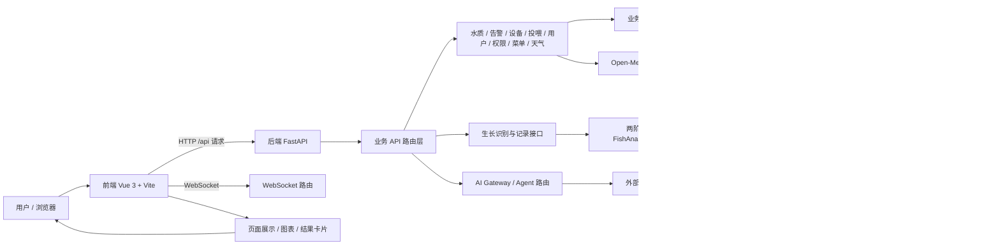
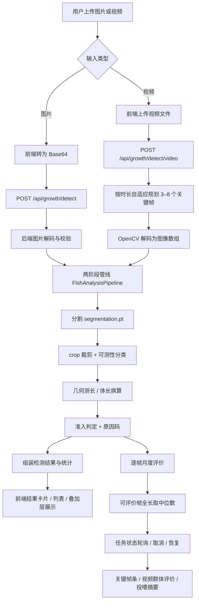

# 智渔精养·石斑鱼智慧养殖一体化系统

## 1. 项目简介
智渔精养·石斑鱼智慧养殖一体化系统是一个前后端分离的渔业管理应用，后端基于 FastAPI 提供统一 API 与 WebSocket 能力，前端基于 Vue 3 + Vite 构建交互界面。仓库内已包含水质监测、智能投喂、设备/告警管理、用户与权限管理、菜单管理、天气查询，以及“生长识别”相关的图片和视频识别能力。

系统主要用于渔业日常管理与识别分析：既可记录和查看水质数据、设备状态与告警，也可通过两阶段生长识别管线（分割 → 可测性分类 → 几何测长）对鱼类生长状态进行图片识别和视频关键帧识别。识别摘要、评价结论和视频统计会保存到 SQLite，并可在“生长记录”页面查询，控制台和投喂页面会自动恢复最近记录。适用场景包括鱼塘监控、养殖生产管理、生长辅助识别、投喂建议查看与管理后台操作。

## 2. 技术栈

| 分层/类别 | 具体技术或依赖 | 用途说明 |
|---|---|---|
| 前端框架 | Vue 3 | 构建单页应用界面 |
| 前端构建工具 | Vite | 本地开发、打包构建、代理转发 |
| 前端语言 | TypeScript | 前端类型约束与模块开发 |
| UI 组件库 | Element Plus | 表单、表格、弹窗、标签等界面组件 |
| 状态管理 | Pinia、pinia-plugin-persistedstate | 管理用户、系统配置、AI 等状态 |
| 路由 | vue-router | 页面路由与权限路由控制 |
| HTTP 请求 | axios | 调用后端 API |
| 图表 | echarts、vue-echarts | 展示统计图表与趋势图 |
| 视频播放 | xgplayer、hls.js | 播放视频或流媒体资源 |
| 富文本/内容处理 | @wangeditor/editor、marked、dompurify | 内容编辑、Markdown 渲染与安全处理 |
| 文件处理 | xlsx、file-saver | 导入导出与文件下载 |
| 可视化/工具 | @vueuse/core、mitt、nprogress、qrcode.vue | 常用交互、事件通信、进度条与二维码 |
| 样式工程化 | Tailwind CSS、Sass、Stylelint、Prettier | 样式开发与代码规范 |
| 后端框架 | FastAPI | 提供 REST API 与 WebSocket 路由 |
| 后端运行 | Uvicorn | 启动 FastAPI 服务 |
| 后端语言 | Python 3.11+ | 后端业务实现 |
| 数据库 | SQLite、SQLAlchemy、sqlalchemy-utils | 持久化水质、用户、告警、菜单和生长识别记录 |
| 数据校验 | Pydantic、pydantic-settings | 配置与接口数据模型 |
| 鉴权/密码 | passlib[bcrypt] | 密码处理与认证相关能力 |
| AI / 模型 | torch、torchvision、ultralytics、Pillow、opencv-python | 两阶段生长识别管线（分割 + 可测性分类 + 几何测长），YOLO 用于分割与分类推理 |
| 外部接口 | httpx、Open-Meteo API | 获取天气数据 |
| 环境配置 | python-dotenv | 读取后端 `.env` |
| 工程化工具 | uv、pnpm | 后端与前端依赖管理 |

## 3. 系统架构图


```mermaid
flowchart LR
    U[用户 / 浏览器] --> F[前端 Vue 3 + Vite]
    F -->|HTTP /api 请求| B[后端 FastAPI]
    F -->|WebSocket| W[WebSocket 路由]

    B --> A[业务 API 路由层]
    A --> WQ[水质 / 告警 / 设备 / 投喂 / 用户 / 权限 / 菜单 / 天气]
    A --> G[生长识别与记录接口]
    A --> AG[AI Gateway / Agent 路由]

    G --> P2[两阶段管线 FishAnalysisPipeline]
    P2 --> SEG[分割模型 segmentation.pt]
    P2 --> CLS[可测性分类器 measurability_classifier.pt]
    P2 --> LEN[几何测长 / 体长换算]
    P2 --> MF[正式清单 pipeline.final.json 驱动]
    SEG -->|legacy 回退| YD[YOLODetector + best.pt]

    WQ --> SV[业务服务层]
    SV --> D[SQLAlchemy ORM]
    D --> DB[(SQLite 数据库)]

    AG --> EXT[外部 AI 服务]
    WQ --> EXTW[Open-Meteo 天气 API]

    F --> UI[页面展示 / 图表 / 结果卡片]
    UI --> U
```

## 4. 项目结构

### 4.1 项目目录树

```text
.
├── backend
│   ├── algorithms
│   │   └── prediction.py
│   ├── app
│   │   ├── main.py
│   │   ├── api/v1/endpoints
│   │   ├── core
│   │   ├── crud
│   │   ├── db
│   │   ├── models
│   │   │   ├── ai
│   │   │   │   ├── best.pt                       # legacy 单模型（回退路径）
│   │   │   │   ├── pipeline/                     # 两阶段生长识别管线
│   │   │   │   │   ├── pipeline.py               # 管线编排
│   │   │   │   │   ├── manifest.py               # manifest 解析与校验
│   │   │   │   │   ├── admission_policy.py       # A5 准入策略模块
│   │   │   │   │   └── segmenter.py / classifier_*.py / crop_builder.py / temporal.py
│   │   │   │   └── releases/
│   │   │   │       └── growth_20260808_v1/       # 冻结权重（分割/分类器/骨干）
│   │   │   └── yolo_detector.py
│   │   ├── routers
│   │   ├── schemas
│   │   ├── services
│   │   ├── tasks
│   │   └── websocket
│   ├── data
│   │   └── smart_fishery_db.db
│   ├── seed_data.py
│   ├── tests/                                    # 单元/接口测试
│   ├── tools/                                    # 审计/评估/复审工具（离线）
│   ├── pyproject.toml
│   └── uv.lock
├── frontend
│   ├── src
│   │   ├── api
│   │   ├── assets
│   │   ├── components
│   │   ├── config
│   │   ├── hooks
│   │   ├── locales
│   │   ├── mock
│   │   ├── plugins
│   │   ├── router
│   │   ├── store
│   │   ├── types
│   │   ├── utils
│   │   └── views
│   │       └── growth-monitoring
│   │           ├── detect                         # 生长识别
│   │           └── records                        # SQLite 生长记录查询
│   ├── public
│   ├── scripts
│   ├── index.html
│   ├── package.json
│   └── vite.config.ts
├── demo_assets/                                 # 演示素材（比赛图/增强图等）
├── dev.py
└── README.md
```

### 4.2 核心目录说明表

| 目录/文件 | 作用说明 |
|---|---|
| `backend/app/main.py` | 后端服务入口，创建 FastAPI 应用，注册 CORS、API 路由和 WebSocket 路由，并在启动时初始化数据库表 |
| `backend/app/api/v1/api.py` | API 汇总入口，统一挂载各业务路由 |
| `backend/app/api/v1/endpoints/` | 后端业务接口实现目录，包含认证、水质、用户、权限、鱼塘、投喂、设备、告警、健康、天气、菜单和生长识别/记录接口 |
| `backend/app/models/` | ORM 模型目录，包含用户、水质数据、告警、菜单和生长记录模型，以及 AI 推理相关代码与权重 |
| `backend/app/models/ai/pipeline/` | 两阶段生长识别管线：分割/裁剪/可测性分类/时序/测长编排，manifest 驱动 |
| `backend/config/growth/pipeline.final.json` | 正式冻结模型清单：模型算法参数唯一真源（分类阈值/厘米换算/几何质量门槛/准入策略） |
| `backend/config/growth/grouper_growth_standard.json` | 养殖标准：月度生长评价规则唯一真源（第 3–15 月预期增长量/偏小偏大比例/图片群体样本规则/视频最少可评价帧数/估重公式） |
| `backend/config/growth/README.md` | 配置目录说明：资料依据、字段含义、职责边界、校验要求与修改后需重启的说明 |
| `backend/app/models/ai/releases/` | 管线冻结权重（segmentation.pt / measurability_classifier.pt / classifier_backbone.pt），随仓库分发 |
| `backend/app/models/ai/yolo_detector.py` | legacy YOLO 推理封装（回退路径，`GROWTH_PIPELINE=legacy` 时使用） |
| `backend/algorithms/prediction.py` | 水质规则分析逻辑，根据传入指标输出分析结果和告警等级 |
| `backend/app/services/` | 业务服务层，包含水质分析、智能投喂、天气服务和仪表盘帧组装逻辑 |
| `backend/app/db/` | 数据库连接、会话和基础表定义 |
| `backend/app/schemas/` | 接口数据结构定义，用于请求和响应校验 |
| `backend/app/websocket/` | WebSocket 管理与路由 |
| `backend/data/smart_fishery_db.db` | 当前仓库中的 SQLite 数据文件 |
| `backend/seed_data.py` | 初始/种子数据脚本，待补充其具体执行方式 |
| `frontend/src/main.ts` | 前端应用入口，初始化 Store、Router、全局指令、错误处理和国际化 |
| `frontend/src/router/` | 前端路由配置、守卫与路由模块 |
| `frontend/src/api/` | 前端 API 封装目录，对接后端各业务接口 |
| `frontend/src/views/growth-monitoring/detect/` | 生长识别页面与组件，负责图片/视频识别交互、结果展示和任务状态管理 |
| `frontend/src/views/growth-monitoring/records/` | 生长识别记录页面，负责 SQLite 记录的筛选、分页、详情和删除 |
| `frontend/src/views/system/menu/` | 菜单管理页面，负责菜单/按钮的增删改和启停状态 |
| `frontend/src/views/dashboard/fishery-console/` | 渔业控制台首页，展示天气、告警、水质、投喂和识别结果等信息 |
| `frontend/src/store/` | Pinia 状态管理目录 |
| `frontend/src/components/` | 可复用业务组件与通用组件 |
| `frontend/src/config/` | 前端配置项，包含 AI、主题、阈值和模块配置 |
| `frontend/public/mock/` | 前端静态 mock 数据 |
| `frontend/public/video/` | 前端示例视频资源 |
| `dev.py` | 根目录联动启动脚本，按顺序启动后端并在健康检查通过后启动前端 |

## 5. 核心功能说明

| 功能模块 | 功能作用 | 输入 | 处理逻辑 | 输出 |
|---|---|---|---|---|
| 生长图片识别 | 对单张图片中的鱼类进行识别 | Base64 图片数据 | `backend/app/api/v1/endpoints/growth.py` 调用两阶段管线 `FishAnalysisPipeline`（分割 → 可测性分类 → 几何测长），模型参数由 `config/growth/pipeline.final.json` 驱动，月度分档与估重由 `config/growth/grouper_growth_standard.json` 驱动，完成检测、体长/重量估算、月度生长评价与统计 | 识别结果、检测列表、统计信息、平均体长/体重、群体评价 assessment、错误码 |
| 生长视频识别 | 对上传视频的关键帧进行识别并形成月度群体评价 | 视频文件、养殖月数、投苗时平均全长 | 后端按视频时长自适应规划 3–8 个关键帧，OpenCV 解码后以图像数组逐帧进入共享识别管线；每帧独立评价，至少 3 个可评价帧时以帧级评价全长中位数形成视频结论。任务支持阶段进度、协作式取消、刷新恢复、终态释放和无模型轻量重评 | 任务 ID、阶段与进度、关键帧结果、跨帧检测记录统计、视频群体评价、部分结果与错误/警告码 |
| 生长记录与跨页联动 | 保存并查询识别后的摘要和评价 | 图片/视频识别摘要、评价参数 | 前端成功识别后写入 `/api/growth/records`；控制台、投喂建议和记录页通过 `/api/growth/records/latest` 恢复最近记录；重评使用 PUT 更新原记录 | SQLite 历史记录、分页列表、详情、群体状态和管理建议 |
| 摄像头流地址获取 | 提供摄像头流播放地址 | 无 | `growth.py` 直接返回一个流地址字符串 | 流地址 |
| 水质数据上报与分析 | 记录并分析水质指标 | 溶解氧、pH、温度、氨氮、亚硝酸盐等 | `algorithms/prediction.py` 根据阈值生成分析结论和告警等级，`services/water_analysis.py` 写入数据库 | 水质分析结果、告警等级、历史记录 |
| 水质仪表盘 | 组织最新水质、设备、告警与指标信息 | 数据库中的水质记录 | `services/water_quality_dashboard.py` 根据历史记录构建当前帧、趋势文本、设备状态与告警列表 | 仪表盘帧数据 |
| 智能投喂 | 根据水质和鱼群信息生成投喂建议 | 鱼塘 ID、鱼数、平均体重等 | `services/smart_feeding.py` 按水质阈值和修正因子计算推荐投喂量与建议 | 推荐投喂量、最佳时间、建议文本、置信度 |
| 天气查询 | 获取当前天气与气压风险 | 经纬度 | `services/weather_service.py` 请求 Open-Meteo API，并计算气压风险等级 | 当前天气、气压风险、更新时间 |
| 用户认证 | 登录与用户信息获取 | 用户名、密码或 token | `app/api/v1/endpoints/auth.py` 结合密码校验与用户信息查询 | 登录结果、用户信息 |
| 用户/角色/菜单管理 | 管理后台用户权限 | 用户、角色、菜单数据 | 通过 CRUD 和路由层完成增删改查与权限映射 | 列表、详情、更新结果 |
| 菜单管理 | 管理目录、页面菜单和按钮权限 | 菜单名称、路由、组件、角色、启停状态 | 前端使用后端菜单模式，从 `/api/v3/system/menus/list` 生成路由；菜单 CRUD 写入 SQLite，空表首次访问时自动写入内置种子菜单 | 菜单树、路由权限、按钮权限和持久化配置 |
| 鱼塘/设备/告警管理 | 管理渔场基础资源与告警记录 | 鱼塘、设备、告警相关数据 | 通过对应 REST 路由访问数据库模型和业务服务 | 列表、详情、状态更新结果 |
| 前端页面交互 | 提供识别、监控、控制台等页面 | 用户操作、API 响应数据 | Vue 页面通过 `src/api/*` 调用后端接口，结合 Pinia、路由守卫和组件化页面渲染 | 页面视图、图表、识别结果、表单与列表 |

## 6. 生长识别流程图


```mermaid
flowchart TD
    A[用户上传图片或视频] --> B{输入类型}
    B -->|图片| C[前端转为 Base64]
    B -->|视频| D[前端上传视频文件]

    C --> E[POST /api/growth/detect]
    D --> F[POST /api/growth/detect/video]

    E --> G[后端图片解码与校验]
    G --> H[两阶段管线 FishAnalysisPipeline]
    H --> H1[分割 segmentation.pt]
    H1 --> H2[crop 裁剪 + 可测性分类]
    H2 --> H3[几何测长 / 体长换算]
    H3 --> I[准入判定 + 原因码]
    I --> J[组装检测结果与统计]
    J --> K[前端结果卡片 / 列表 / 叠加层展示]

    F --> N[按时长自适应规划 3–8 个关键帧]
    N --> O[OpenCV 解码为图像数组]
    O --> H
    I --> P[逐帧月度评价]
    P --> P1[可评价帧全长取中位数]
    P1 --> Q[任务状态轮询 / 取消 / 恢复]
    Q --> R[关键帧条 / 视频群体评价 / 投喂摘要]
```

## 7. 环境要求

| 项目 | 要求 |
|---|---|
| 操作系统 | Windows、Linux、macOS 均可，仓库当前开发环境为 Windows |
| Python 版本 | `>= 3.11.8` |
| Node.js 版本 | `>= 20.19.0` |
| 包管理工具 | 后端使用 `uv`，前端使用 `pnpm` |
| 数据库/中间件 | SQLite |
| GPU / CUDA 要求 | 仓库未强制要求，`torch` 与 `ultralytics` 可用 CPU 推理；如使用 GPU 环境需自行匹配 CUDA，待补充 |
| 其他运行依赖 | `opencv-python`、`Pillow`、`httpx`、`python-multipart`、`passlib[bcrypt]`、`uvicorn` |

## 8. 安装与部署

### 8.1 克隆项目

本仓库暂无 Docker 或线上部署脚本，当前以“拉取仓库后在本地启动”为准。或者直接解压压缩包。

```bash
git clone https://github.com/Yihe-ng/smart-fishery.git
```

### 8.2 安装后端依赖

进入后端目录后安装依赖：

```bash
cd backend
uv sync
```

### 8.3 安装前端依赖

进入前端目录后安装依赖：

```bash
cd frontend
pnpm install
```

### 8.4 配置环境变量

请在以下位置自行创建或补全环境文件：

| 文件位置 | 说明 |
|---|---|
| `backend/.env` | 后端环境变量文件，需要自行创建或补全，仓库中已存在示例内容但建议本地按需重建 |
| `frontend/.env.development` | 前端开发环境变量文件，仓库中已存在 |
| `frontend/.env.production` | 前端生产环境变量文件，仓库中已存在 |

后端 `.env` 建议包含以下模板内容（生长识别开关为可选，缺省使用默认值）：

```env
DATABASE_URL=sqlite:///./data/smart_fishery_db.db

ai_mode=real
agent_sk=请在本地填写
ai_model=qwen3.5-flash
ai_base_url=请在本地填写

# 生长识别推理路径：two_stage（冻结两阶段管线，默认）| legacy（旧 YOLO 回退）
GROWTH_PIPELINE=two_stage
# 模型清单覆盖（为空使用正式清单 config/growth/pipeline.final.json）
GROWTH_MANIFEST_PATH=
# 养殖标准覆盖（为空使用 config/growth/grouper_growth_standard.json）
GROWTH_STANDARD_PATH=
# 推理设备：cpu（默认）| cuda:0
GROWTH_PIPELINE_DEVICE=cpu
# 视频时序覆盖：留空跟随模型清单；也可显式设为 true/false
GROWTH_VIDEO_TEMPORAL_ENABLED=

# 视频任务运行参数（以下均为默认值）
VIDEO_MIN_DURATION_SECONDS=3.0
VIDEO_TARGET_INTERVAL_SECONDS=2.0
VIDEO_MIN_FRAMES=3
VIDEO_MAX_FRAMES=8
VIDEO_PROCESS_SOFT_LIMIT_SECONDS=120.0
VIDEO_PROCESS_MAX_SECONDS=180.0
VIDEO_TASK_TTL_SECONDS=3600
VIDEO_MAX_TERMINAL_TASKS=3
VIDEO_DISPLAY_MAX_EDGE=1280
VIDEO_DISPLAY_JPEG_QUALITY=85
```

> **配置分工（三层）**：
> 1. `.env` / `backend/app/core/config.py` 只放运行开关（管线选型、配置文件路径、推理设备、视频任务采样/时间预算/生命周期、视频目录等）。
> 2. 模型算法参数（分类阈值、分割置信门槛、厘米换算、几何质量门槛、准入策略）统一在 `backend/config/growth/pipeline.final.json`。
> 3. 养殖业务参数（第 3–15 月预期累计增长量、偏小/偏大比例、图片群体最小样本与去极端规则、视频最少可评价帧数、估重公式）统一在 `backend/config/growth/grouper_growth_standard.json`。
>
> 每类参数只有一个真源，修改参数不需要改代码，但**必须重启后端**才生效。详见 `backend/config/growth/README.md`。

前端开发环境变量当前可参考：

```env
VITE_BASE_URL=/
VITE_PORT=3006
VITE_API_URL=/
VITE_API_PROXY_URL=http://127.0.0.1:8000
VITE_ACCESS_MODE=backend
VITE_DROP_CONSOLE=false
```

#### 生长识别状态显示开关

生长识别页的“偏小 / 正常 / 偏大”状态字段由前端源码开关控制：

```ts
// frontend/src/views/growth-monitoring/detect/constants/statusColors.ts
export const SHOW_GROWTH_STATUS_UI = false
```

| 取值 | 页面行为 |
|---|---|
| `false`（当前值） | 隐藏群体状态标签、状态分布表、单鱼状态及图片标注中的状态词，仅保留体长等信息 |
| `true` | 恢复上述状态字段展示 |

该开关只改变生长识别页的前端渲染，不影响后端评价、接口字段或已保存数据。开发环境修改后可热更新；生产环境修改后需重新执行 `pnpm build` 并部署前端。

### 8.5 初始化必要服务

| 项目 | 说明 |
|---|---|
| SQLite 数据库 | 后端启动时通过 `Base.metadata.create_all(bind=engine)` 创建表结构，并自动补齐已有 `growth_records` 表的新字段；菜单表为空时首次访问菜单接口会写入内置种子菜单 |
| 模型文件 | 两阶段管线权重位于 `backend/app/models/ai/releases/growth_20260808_v1/`（segmentation.pt / measurability_classifier.pt / classifier_backbone.pt），已随仓库分发，无需手动准备；legacy 回退路径依赖 `backend/app/models/ai/best.pt` |
| 外部天气接口 | `weather_service.py` 会访问 Open-Meteo API，联网环境下可直接使用 |

### 8.6 数据库初始化

仓库内包含 SQLite 数据文件：

```text
backend/data/smart_fishery_db.db
```

### 8.7 Linux 部署要点

部署目标机为 Linux 设备（无 Windows 依赖），按以下要点操作：

1. **克隆仓库后无需额外拷贝模型**：两阶段管线权重（`backend/app/models/ai/releases/growth_20260808_v1/`）已随仓库分发，manifest 中的模型路径为相对路径，自动解析到仓库根。
2. **必须创建 `backend/.env`**：该文件未入库（gitignore），需按 §8.4 模板手动创建；至少包含 `DATABASE_URL` 与 AI 网关配置；生长识别开关缺省即用默认值（`two_stage` / `cpu`）。
3. **生产代码无 Windows 绝对路径依赖**：模型路径、数据目录均为相对路径；视频目录默认指向 `../frontend/public/video`（相对 backend）。
4. **依赖安装**：后端 `uv sync`（需 uv），前端 `pnpm install`（可选，若只跑后端 API 可跳过前端构建）。
5. **启动**：`cd backend && uv run python -m app.main`，健康检查 `http://<IP>:8000/health`；如需外网访问，用 `uvicorn`/systemd 托管并开放 8000 端口。
6. **CPU 推理**：默认 `GROWTH_PIPELINE_DEVICE=cpu`，无需 GPU/CUDA；推理耗时较 GPU 长属正常。


## 9. 启动方法

### 9.1 启动前准备

先确认以下内容：

| 检查项 | 说明 |
|---|---|
| 后端依赖 | 已执行 `uv sync` |
| 前端依赖 | 已执行 `pnpm install` |
| 数据库文件 | `backend/data/smart_fishery_db.db` 可访问 |
| 模型文件 | 两阶段管线权重 `backend/app/models/ai/releases/growth_20260808_v1/` 存在（legacy 路径还需 `best.pt`） |
| 后端端口 | 默认 `8000`，如被占用需先释放 |
| 前端端口 | 开发环境默认 `3006`，如被占用需修改 `frontend/.env.development` |

### 9.2 启动后端

必须先启动后端服务。进入 `backend` 目录后执行：

```bash
cd backend
uv run python -m app.main
```

后端健康检查地址为：

```text
http://127.0.0.1:8000/health
```

### 9.3 启动前端

确认后端正常后，再启动前端。进入 `frontend` 目录后执行：

```bash
cd frontend
pnpm dev
```

前端开发地址由 `frontend/.env.development` 中的 `VITE_PORT` 决定，当前默认是：

```text
http://localhost:3006
```

### 9.4 使用开发主程序一键启动

如果希望在仓库根目录一次性启动前后端，可以直接运行 `dev.py`。该脚本已经包含：

| 能力 | 说明 |
|---|---|
| 环境校验 | 检查 Python、`uv`、`pnpm` 是否可用 |
| 项目文件校验 | 检查 `backend/pyproject.toml`、`backend/app/main.py`、`frontend/package.json` 是否存在 |
| 依赖校验 | 检查 `backend/.venv` 和 `frontend/node_modules` 是否已准备好 |
| 启动顺序 | 先启动后端，再等待 `/health` 通过，最后启动前端 |
| 错误处理 | 后端或前端异常退出时会直接输出错误并结束进程 |

在仓库根目录执行：

```bash
python dev.py
```

该方式适合本地开发联调，且启动顺序仍然是先后端、后前端。

## 10. 使用方法

### 10.1 Web 页面使用

| 场景 | 操作流程 | 结果 |
|---|---|---|
| 生长图片识别 | 打开前端后进入“生长识别”页面，上传图片 | 页面返回检测框、类别状态、体长估算、重量估算和统计信息 |
| 生长视频识别 | 在“生长识别”页面上传视频文件 | 后端生成异步任务，前端轮询任务状态并展示关键帧识别结果 |
| 控制台查看 | 打开渔业控制台首页 | 查看天气、水质、告警、投喂和识别结果等信息 |
| 生长记录查询 | 打开“生长记录”页面 | 按池塘、来源和日期筛选 SQLite 中的识别记录，查看详情或删除记录 |
| 菜单管理 | 以管理员身份打开“系统管理 → 菜单管理” | 管理目录、页面菜单和按钮权限；修改后重启不会丢失 |
| 水质监控 | 打开水质监控页面 | 查看最新水质、历史数据、阈值和仪表盘帧数据 |
| 智能投喂 | 打开投喂页面 | 查看投喂配置、日志和智能投喂建议 |

### 10.2 接口调用示例

#### 图片生长识别

```bash
curl -X POST "http://127.0.0.1:8000/api/growth/detect" \
  -H "Content-Type: application/json" \
  -d "{\"image\":\"<Base64字符串>\"}"
```

#### 视频生长识别

```bash
curl -X POST "http://127.0.0.1:8000/api/growth/detect/video" \
  -F "file=@./sample.mp4" \
  -F "cultureMonth=6" \
  -F "stockingAvgLengthCm=13"
```

#### 查询视频任务

```bash
curl "http://127.0.0.1:8000/api/growth/detect/video/<task_id>"
```

#### 取消或释放视频任务

```bash
# 排队任务立即取消；处理中任务在当前帧返回后停止
curl -X POST "http://127.0.0.1:8000/api/growth/detect/video/<task_id>/cancel"

# 只释放 success / failed / cancelled 终态任务
curl -X DELETE "http://127.0.0.1:8000/api/growth/detect/video/<task_id>"
```

完成后修改月份或投苗体长时，前端调用 `POST /api/growth/evaluate/video`，只提交已有关键帧的鱼体标识、可测性和体长，不重新上传视频或运行模型。

#### 生长记录接口

```bash
# 查询分页记录
curl "http://127.0.0.1:8000/api/growth/records?page_num=1&page_size=10"

# 查询某池塘最近一次记录
curl "http://127.0.0.1:8000/api/growth/records/latest?pond_id=T001"
```

识别成功后由前端自动写入记录；演示数据不会落库。数据库只保存跨页面展示所需的摘要、评价和视频统计，不保存图片 Base64、掩码或单鱼检测明细。

#### 菜单接口

```bash
# 查询菜单树
curl "http://127.0.0.1:8000/api/v3/system/menus/list"

# 查询简化菜单列表
curl "http://127.0.0.1:8000/api/v3/system/menus/simple"
```

前端默认使用 `VITE_ACCESS_MODE=backend`。如需临时恢复前端静态路由，可将该值改为 `frontend` 并重新启动/构建前端。

#### 查询摄像头流地址

```bash
curl "http://127.0.0.1:8000/api/growth/camera/stream"
```

## 11. 常见问题与注意事项

| 问题 | 可能原因 | 处理建议 |
|---|---|---|
| 后端启动失败 | `uv` 未安装、依赖未同步、Python 版本不满足 | 检查 `uv --version`，重新执行 `uv sync`，确认 Python >= 3.11.8 |
| 前端启动失败 | `pnpm` 未安装或 `node_modules` 缺失 | 在 `frontend` 目录重新执行 `pnpm install` |
| 识别接口返回模型错误 | 管线权重缺失或损坏 | 确认 `backend/app/models/ai/releases/growth_20260808_v1/` 下三个 .pt 文件存在且可读取（legacy 路径检查 `best.pt`） |
| 图片识别失败 | 上传内容不是有效图片或体积过大 | 检查 Base64 是否正确，图片是否超过 10MB 左右限制 |
| 视频识别失败 | 视频短于 3 秒、格式不支持、文件太大或无法解码 | 使用时长不少于 3 秒的 `.mp4`、`.mov`、`.webm`、`.avi`、`.mkv` 等支持格式，并控制文件大小 |
| 视频仅返回部分结果 | 达到处理时间预算或个别关键帧解码/分析失败 | 已完成关键帧仍可查看；结合 `warningCode` 判断超时、取消或单帧失败，不把跨帧检测记录数解释为独立鱼只数 |
| 前后端接口不通 | 前端代理指向错误或后端未启动 | 确认后端已启动，再检查 `frontend/.env.development` 中的 `VITE_API_PROXY_URL` |
| 页面跨域或 Cookie 问题 | 前端开发地址与后端 CORS 配置不一致 | 确认前端端口在 `3006` 或 `3008` 范围内，后端 CORS 已允许这些来源 |
| SQLite 写入失败 | 数据库文件权限不足或路径不存在 | 检查 `backend/data/smart_fishery_db.db` 权限和目录是否存在 |
| 外部天气接口异常 | 网络不可用或 Open-Meteo 请求失败 | 检查网络连接，重试请求 |
| AI 网关调用失败 | `backend/.env` 中 AI 配置未补齐 | 在本地补充 `ai_mode`、`agent_sk`、`ai_base_url` 等配置 |

## 12. 后续优化方向

1. 将后端接口返回的错误码与前端提示文案进一步统一，减少页面内硬编码映射。
2. 如需严格中断卡死的同步模型推理，将视频推理隔离到独立进程，并把当前内存任务队列升级为可持久化任务系统。
3. 为模型文件、数据库初始化和种子数据增加独立校验脚本，降低手工准备风险。
4. 将水质分析、投喂建议和生长识别结果整理为更统一的数据契约，便于前后端协作和测试。

## 13. 致谢

| 开源项目 | 说明 |
|---|---|
| [art-design-pro](https://github.com/Daymychen/art-design-pro) | 本项目的前端框架基于该开源项目改进而来，前端目录结构、页面组织和部分工程化能力受其影响。 |
| [page-agent](https://github.com/alibaba/page-agent) | 项目中使用了该开源能力，并进行了部分移植和修改，用于前端相关的页面代理和交互能力。 |
