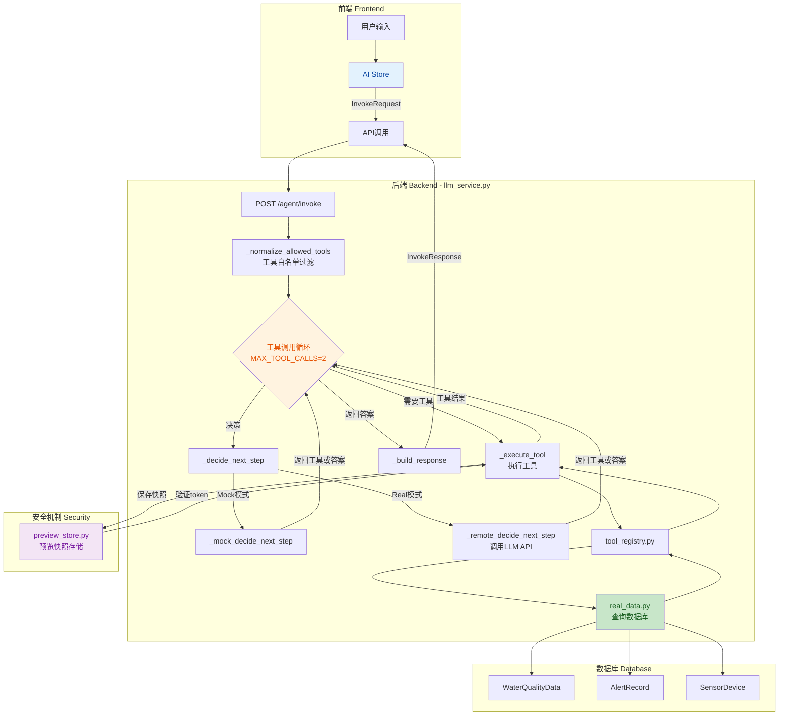
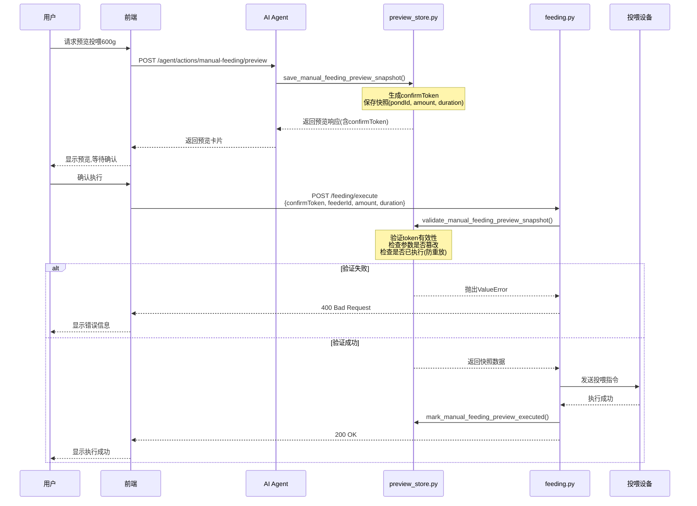

# pageAgent说明文档

## 1. 模块定位
`pageAgent` 是智慧渔业系统的 AI 助手模块，提供两类能力：
- 问答：基于当前页面上下文答疑，不触发自动化执行。
- 自动化：按"预览 -> 确认 -> 执行"流程完成业务操作（首期开放手动投喂）。

## 2. 技术说明

### 2.1 架构（混合模式）

```
前端 PageAgentCore
    ↓ customFetch（透传）
后端 /api/agent/agent/invoke
    ↓ invoke_llm()
LLM 服务（mock/real）
    ↓ 结构化响应 { type: "answer" | "tool" }
PageAgentCore 解析并执行工具
    ↓ 代理工具 execute()
后端 /api/agent/tools/{tool_name}
    ↓ run_tool() → real_data.py
业务数据返回
```

PageAgent 运行在前端，LLM 调用通过 `customFetch` 转发到后端，API Key 保存在 `backend/.env`，不暴露前端。

### 2.2 前端文件
- `frontend/src/ai/page-agent-runtime.ts`：创建 PageAgentCore，配置 customFetch、customTools、instructions。
- `frontend/src/ai/proxy-tools.ts`：代理工具定义，execute() 调用后端 `/api/agent/tools/{name}`。
- `frontend/src/store/modules/ai.ts`：状态机、问答/自动化分流、风险确认，使用 `agent.execute()` 驱动。
- `frontend/src/components/core/layouts/art-ai-assistant/index.vue`：全局 AI 弹窗。
- `frontend/src/views/feeding/components/AISuggestionPanel.vue`：投喂建议面板。
- `frontend/src/config/ai.ts`：问候语、模式文案、页面标签、警告黑名单。
- `frontend/src/composables/use-demo-frame-snapshot.ts`：Demo快照全局状态管理，支持 `currentIndex` 切换历史数据。

### 2.3 后端文件
- `backend/app/agent/llm_service.py`：LLM 调用入口，支持 Mock/Real 双模式，最多2次工具调用循环。
- `backend/app/agent/router.py`：AI 路由，含 `/agent/invoke`、`/tools/{tool_name}`、`/agent/bootstrap` 等端点。
- `backend/app/agent/tool_registry.py`：工具定义（TOOL_DEFINITIONS）、页面白名单（PAGE_TOOL_WHITELIST）、工具执行（run_tool）。
- `backend/app/agent/context_builder.py`：构建 bootstrap/context、UI 能力开关、系统提示词（支持 intent 参数）。
- `backend/app/agent/schemas.py`：AI 协议类型定义，含 InvokeRequest/Response、ConfirmPreview 等。
- `backend/app/agent/real_data.py`：真实数据访问层，从数据库查询水质、告警、设备数据，支持 `currentIndex` 参数。
- `backend/app/agent/preview_store.py`：预览快照存储，防参数篡改和重放攻击。

### 2.4 状态机
- `AIUIState`: `idle | chatting | previewing | confirming | executing | failed`
- `AIIntentType`: `qa | automation`

### 2.5 AI Agent 工具调用流程



## 3. 调用链路

### 3.1 问答模式
```
用户输入 → sendQA()
    → createPageAgent({ intent: 'qa' })
    → agent.execute(text)
    → customFetch → POST /api/agent/agent/invoke
    → invoke_llm() → { type: "answer", assistantMessage: "..." }
    → PageAgent 解析 answer → result.data
    → appendAssistantMessage(result.data)
```

### 3.2 自动化模式（工具调用）
```
用户输入 → runAutomation()
    → createPageAgent({ intent: 'automation' })
    → agent.execute(text)
    → customFetch → POST /api/agent/agent/invoke
    → invoke_llm() → { type: "tool", toolName: "get_water_quality_summary", arguments: { pondId } }
    → PageAgent 调用代理工具 execute()
    → POST /api/agent/tools/get_water_quality_summary
    → run_tool() → real_data.py → 数据库
    → PageAgent 继续推理 → done
    → appendAssistantMessage(result.data)
```

### 3.3 手动投喂预览（独立流程）
```
requestManualFeedingPreview(amount)
    → POST /api/agent/actions/manual-feeding/preview
    → build_manual_feeding_preview() → preview_store.save_snapshot()
    → 返回 AIConfirmPreview（含 confirmToken、riskLevel）
    → latestPreview 展示在 UI
    → executeLatestPreview() → 风险确认 → POST /api/agent/feeding/execute
    → feeding_service 验证 confirmToken → 执行投喂 → preview_store.mark_executed()
```

### 3.4 手动投喂安全流程



## 4. 工具注册

### 4.1 后端工具定义（tool_registry.py）
| 工具名 | 描述 | 页面白名单 |
|--------|------|-----------|
| `get_water_quality_summary` | 获取当前鱼塘水质摘要和关键指标（基于实时数据） | 全部页面 |
| `get_feeding_recommendation` | 获取智能投喂建议（基于实时水质和天气） | global-chat、feeding |
| `get_alert_digest` | 获取告警摘要和最新告警列表（基于实时数据） | 全部页面 |
| `get_device_status` | 获取设备状态统计（基于实时数据） | 全部页面 |
| `preview_manual_feeding_action` | 生成手动投喂预览（含防篡改token） | feeding |

### 4.2 前端代理工具（proxy-tools.ts）
前端通过 `createProxyTools(allowedTools)` 动态注册代理工具到 PageAgentCore：
- 工具 `execute()` 调用 `fetchExecuteTool(toolName, { arguments })` → 后端执行
- 问答模式：过滤掉 `preview_manual_feeding_action`
- 自动化模式：注册全部 allowedTools

### 4.3 结构化响应格式
后端 `invoke_llm()` 返回结构化 JSON，不再是 OpenAI-compatible 格式：

问答响应：
```json
{
  "type": "answer",
  "assistantMessage": "给用户的中文回答"
}
```

工具调用响应：
```json
{
  "type": "tool",
  "toolName": "get_water_quality_summary",
  "arguments": { "pondId": "pond-001", "currentIndex": 0 }
}
```

### 4.4 InvokeResponse 结构
后端 `/agent/invoke` 接口返回的完整响应结构：
```typescript
{
  status: "completed" | "degraded" | "requires_confirmation",
  assistantMessage: "给用户的回答",
  toolCalls: [{ name: "工具名", arguments: {} }],
  toolResults: [{ tool: "工具名", output: {}, ok: true }],
  confirmPreview: {
    actionType: "manual_feeding_preview",
    previewText: "已生成手动投喂预览...",
    riskLevel: "warning",
    confirmToken: "preview-xxx",
    pondId: "pond-001",
    feederId: "feeder-001",
    amount: 600,
    duration: 10,
    expiresAt: "2024-01-01T10:10:00"
  },
  warnings: ["警告信息"],
  messageId: "msg_xxx"
}
```

## 5. Demo快照功能

### 5.1 功能说明
支持 `currentIndex` 参数切换查看历史数据快照，便于演示和回溯分析。

### 5.2 状态管理
```typescript
// frontend/src/composables/use-demo-frame-snapshot.ts
interface DemoFrameSnapshotState {
  currentIndex?: number  // 快照索引
  pondId?: string       // 池塘ID
  collectTime?: string  // 采集时间
}
```

### 5.3 使用位置
- `fishery-console/index.vue` - 加载仪表板时设置快照
- `art-header-bar/index.vue` - 打开AI助手时传递快照信息
- `feeding/index.vue` - 投喂页面使用快照数据

## 6. 安全机制

### 6.1 手动投喂预览-确认模式
手动投喂采用"预览 -> 确认 -> 执行"模式，防止参数篡改和重放攻击。

### 6.2 预览快照存储（preview_store.py）
| 安全措施 | 实现方式 |
|----------|----------|
| 防止参数篡改 | 执行时验证所有参数与预览快照一致 |
| 防止重放攻击 | 执行后标记 `executed=true`，拒绝重复执行 |
| 防止过期 | 自动清理过期快照（10分钟有效期） |

### 6.3 快照数据结构
```python
@dataclass
class ManualFeedingPreviewSnapshot:
    confirm_token: str      # 确认令牌
    pond_id: str | None     # 池塘ID
    feeder_id: str          # 投喂设备ID
    amount: float           # 投喂量
    duration: int           # 投喂时长
    expires_at: str         # 过期时间
    executed: bool = False  # 是否已执行
```

### 6.4 执行接口变更
| 项目 | 旧实现 | 新实现 |
|------|--------|--------|
| 请求方式 | Query参数 | Request Body |
| 必需参数 | feederId, amount, duration | confirmToken, feederId, amount, duration |
| 安全验证 | ❌ 无 | ✅ 预览快照验证 |

执行请求体：
```json
{
  "confirmToken": "preview-xxx",
  "feederId": "feeder-001",
  "amount": 600,
  "duration": 10,
  "pondId": "pond-001"
}
```

## 7. 使用说明

### 7.1 打开方式
- 点击顶部栏 AI 入口图标打开助手弹窗。
- 首屏问候语：`你好！我是智慧渔业小助手，我可结合当前系统状态答疑，替你操作。`

### 7.2 问答
1. 在"问答"Tab 输入问题，`Ctrl + Enter` 或点击发送。
2. PageAgent 调用后端 LLM，可自动调用查询类工具获取数据后回答。
3. 仅展示面向用户的回答文本，不展示协议字段和调试文案。

### 7.3 自动化
1. 在"自动化"Tab 发起预览或选择预设。
2. PageAgent 可调用全部工具，包括 `preview_manual_feeding_action`。
3. 风险确认规则：
   - `low`：可直接执行。
   - `warning`：一次确认。
   - `critical`：二次确认。
4. 执行复用业务接口：`/api/agent/feeding/execute`。

## 8. 可配置项

### 8.1 后端 `.env`
- `ai_mode=mock|real`
- `agent_sk=<模型密钥>`
- `ai_model=<模型名>`
- `ai_base_url=<网关地址>`

### 8.2 前端配置
- `AI_WELCOME_MESSAGE`
- `AI_MODE_LABEL`
- `AI_PAGE_LABEL`
- `AI_WARNING_BLACKLIST`

## 9. UI/UX 约束（当前版本）
- AI 相关图标统一使用 `ArtAiIcon`（顶部入口、AI 面板等）。
- 术语统一：使用"控制台"，不使用"驾驶舱"。
- 深色模式下图标与文本必须保持可见（遵循现有主题变量，不新增孤立色值体系）。
- 禁止展示调试文案（如 `Response generated by upstream model service.`）。

## 10. 后续开发指南
1. 新增自动化动作时，必须走 `automation` 通道，不得复用 QA 执行链路。
2. 新增工具时：
   - 后端在 `tool_registry.py` 的 `TOOL_DEFINITIONS` 中添加定义和 handler。
   - 在 `PAGE_TOOL_WHITELIST` 中配置页面白名单。
   - 前端在 `proxy-tools.ts` 的 `PROXY_TOOL_DEFINITIONS` 中添加对应代理工具。
3. 能力开关统一由 `uiCapabilities` 控制：
   - `showAutomationTab`
   - `canPreview`
   - `canExecute`
4. 文案集中在 `frontend/src/config/ai.ts`，禁止在组件中散落硬编码。
5. AI 相关文件统一 UTF-8（无 BOM），合并前清理乱码与调试残留。
6. 前端门禁必须通过：
   - `eslint`
   - `vue-tsc --noEmit`

## 11. 破坏性变更提醒

### 11.1 API路径前缀变更
```
旧：/api/ai/  →  新：/api/agent/
```
涉及接口：bootstrap、context、invoke、suggestions/feeding、actions/manual-feeding/preview

### 11.2 响应格式完全重构
旧格式为 OpenAI-compatible 格式，新格式为结构化 JSON，详见 4.3 和 4.4 节。

### 11.3 手动投喂必须先获取预览token
旧流程可直接执行，新流程必须先调用预览接口获取 `confirmToken`，执行时携带 token 验证。

### 11.4 环境模式默认值变更
```
environmentMode: "mock" → "real"
sourceMode: "mock" → "real"
mode: "mock" → "real"
```
